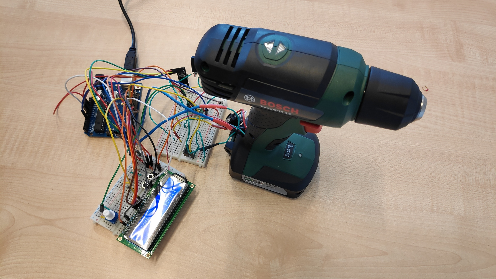
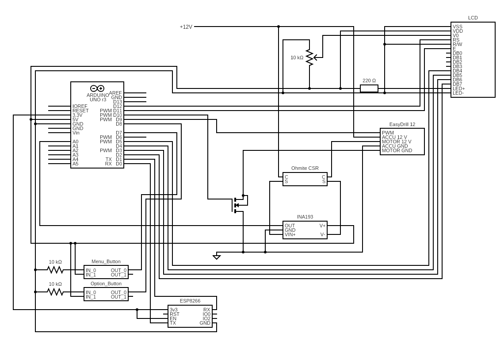
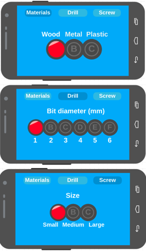

# Docking Station

Docking Station for drills.



## In short

With our **smartphone** and **docking station**, we created a ***“smart drill”***, that can drill **3** different **materials** with **6** different **bit diameters**.

The station **calculates** the **optimal** **torque** for the drill.

If it reaches a maximum torque, the drill stop for a second.

## Description

### Components

Components of our docking station:

- Arduino UNO
- ESP-01
- LCD display
- Ohmite CSR
- INA193

And of course, the drill itself.



### Station settings

The user can choose from 3 different drill material, from 6 different bit diameters and from 3 screw sizes.

Materials:

- wood
- aluminium
- plastic

The bit diameters are from 1 mm up to 6 mm.

Screw sizes:

- small
- medium
- large

### Mobile application

After we started the station, we can connect to it with our **smartphone**. For this, we need an application from the phones application store.

The name of the application is **[Remote XY](https://remotexy.com/)**. In the application we can connect to the station via **WIFI**. After we connected to the station, a nice user interface will show up.

Hier we have 3 pages:

- Materials
- Drill
- Screw

On the Materials page we can set the **materials**.

On the Drill page we can set the bit **diameter**.

On the last page, the Screw page, we can set the **size** for the screw.



### Manual settings

If our hands are dirty, our we just don't have our phone with us, we can set these parameters on the docking station.

On the station, the settings are **displayed** on an **LCD** **screen**. We can navigate in the settings with two **push** **buttons**, next to the display.

One button can **navigate** in the **settings**, and the other can **set** the **options** for that menu.

An **asterisk** character shows, which menu is **active**.

***We only can use our mobile application for this, if we are in the "fourth" menu, so the asterisk character doesn't show up.***

### Code

For the mobile application, we used the **RemoteXY** **library**. On their website, we made the **user** **interface**, than we downloaded the code and inserted into the Arduino IDE.

*Because we used the free version for this, we can use the application only for 30 seconds.*

This library communicates with the **ESP-01** via **WIFI**. We set the *SSID* to `BOSCH`, the *password* to `123456` and the *port* *number* to `6377`.

On the user interface, we only have *3 select elements*. These are defined in the `RemoteXY` struct.

For the materials and sizes, we created `enums`.

```c++
enum Materials { Wood, Aluminium, Steel };
enum Size { Small, Medium, Large };
```

For the push buttons, we used **de-bouncing**.

In the `setup` section, we define our mobile application interface, start the LCD display and set all the pins.

In the `loop` function we are reading the menu button value, than the option button value.

If we are in *menu 4*, we get all the data from the application, otherwise from the buttons.

After we selected all the options either from our phone or from the docking station, we print the data to the LCD display.

For the print, we created a function called `printLCD`, that is positioning the cursor and writes all the options to the right place.

Then we handle if the torque is reaches a maximum level. If it happens, the program stoppes for a second.

At the end of this section, we are calculating the rigth torque for the drill.

### Torque

Calculating the ideal cutting speed for the given materials, we obtained the ideal speed for the drill bits of different diameters.